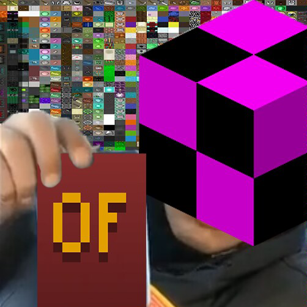
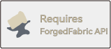

# Opti "NOT" Fine ! (No Indium? Unofficial Forge Port) 

[](https://www.curseforge.com/minecraft/mc-mods/forgedfabric)

Opti "NOT" Fine ! is a small, jij-able mod for maximum warning to players who have OptiFine installed.

## Features

- Warns users using OptiFine;
- Configurable (disable one of the previous features, remove "Proceed Anyway" button).

<!---
## Adding to your project


```
repositories {
    maven {
        url = 'https://maven.cafeteria.dev/releases/'
    }
}

dependencies {
    modImplementation "me.luligabi:NoIndium:[VERSION]"
    include "me.luligabi:NoIndium:[VERSION]"
}
```
--->
